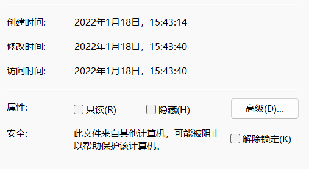

## 零.原理部分

关于处理氢谱线绘制银河旋转曲线的原理部分可见于[【射电望远镜】绘制银河系旋转曲线](https://www.bilibili.com/video/BV1VX4y1g7jU?spm_id_from=333.999.0.0)

当然，也可以直接略过，用代码来处理数据

声明：代码的算法不太精确，估计只能看个大概

## 一.文件命名

为了方便数据的处理，文件命名如[图1](#文件命名)所示，即'赤经 赤纬'，注意空格

例如17h4m为赤经，当然精确到s也是可以的，比如17h4m3s

41d为赤纬，也可精确到小数点后，比如41.23214d

<i><b>
图1：文件命名
</b></i>

## 二.数据格式

通过SDRSharp的IF average进行积分平均后的频谱txt文件格式如[图2](#数据格式)所示

第一行与积分平均的次数有关，不用考虑

第一列是观测频率，单位是MHz

第二列是信号强度，单位应该是电压，即V

<i><b>
图2：数据格式
</b></i>

## 三.观测时间和地点

Main.py文件中代码是根据文件的创建时间来返回UTC时间的，如[图3.1](#观测时间)所示

<i><b>
图3.1：观测时间
</b></i>

文本文件（频谱文件）有创建时间，修改时间，访问时间三种时间属性，如图[图3.2](#文件时间属性)；文件重命名不会改变任意一种时间属性；硬盘上进行拷贝的话应该会改变创建和访问时间，但是修改时间不会变动。

<i><b>
图3.2：文件时间属性
</b></i>

然而把数据直接上传到gitee仓库中后，再下载回来的话，文本文件所有时间属性就都变为下载时刻的时间了；所以便把数据压缩到了Data.zip这个压缩包中，大家下载后可以解压为目录下同名文件夹，如[图3.3](#把Data解压到同名文件夹)。然而仍然存在一个问题，如果用windows自带的解压，解压后文件的创建时间才是观测时间 ，如果用我电脑上Bandzip这个解压工具进行解压，解压后文件的修改时间才是观测时间。于是在此 **便默认大家都用Win10自带的解压，创建时间才是观测时间** 。

当然，具体是哪个时间属性才是观测时间，可以观察一下文件的属性，如果有一个时间属性不同文件时不同的，那应该便是观测时间了。如果你想 **以文件的修改时间为观测时间** ，可以将[图3.1](#观测时间)LocalTime = os.stat(obs_Dir+obs_Source+'.txt').st_mtime中的 **st_mtime改为st_ctime** 。

<i><b>
图3.3：把Data解压到同名文件夹
</b></i>

观测地点可在Main.py文件中进行修改，如[图3.4](#观测地点)所示。obs_Site = '110.81285 32.59175 40'中的110.81285代表经度，32.59175代表纬度，40代表海拔为40m。

<i><b>
图3.4：观测地点
</b></i>

## 四.示例数据来源

在湖北省十堰市观测的氢谱线数据，利用赤道仪进行天体定位，天线为栅格抛物面，该天线在曾在B站“从零开始的业余射电天文”系列中介绍过，见于[图4.1](#B站视频)，

[点击此转到视频链接](https://www.bilibili.com/video/BV1Sh411b7fV?spm_id_from=333.999.0.0)；

<i><b>
图4.1：B站视频
</b></i>

其中放大滤波器没有采用视频中推荐的，而采用了咸鱼某款，如[图4.2](#咸鱼卖家)所示的蓝色板子，1420MHz具有40-50dB的增益，噪声系数也很低。

<i><b>
图4.2：咸鱼卖家
</b></i>

## 五.代码适用范围

旋转曲线代码适合处理在银纬0°附近，银经0°到90°和270°到360°的观测到的氢谱线

旋臂成像代码可以处理在银纬0°附近，所有银经范围内的氢谱线。

在银纬0°附近，不同银经对应的赤经赤纬如[图5](#推荐扫描点坐标)

第一列为银经，第二列为赤经，第三列为赤纬。

<i><b>
图5：推荐扫描点坐标
</b></i>

## 六.python的使用

在运行代码前，请确保你的python库中含有“astropy，numpy
，matplotlib，pandas，scipy”这五个包

或者直接安装anaconda这个软件，里面集成了很多科学计算的包，但没有astropy这个包，不过在anaconda可以手动安装这个包

如果在anaconda自带的编译器spyder中直接运行Main.py文件，当它发现缺少astropy这个包时，会自动下载。不过默认的包下载地址应该在国外，所以下载速度有些慢

python安装包或者安装anaconda的教程可见于B站，或者直接使用搜索引擎

全部的代码文件如[图6.1](#全部代码)所示

<i><b>
图6.1：全部代码
</b></i>

所有的频谱txt文件均放于Data，运行Main.py文件

可以得到 **氢谱线相对于日心的径向速度** vs **谱线的等效温度(即强度)** 的频谱图，如[图6.2](#频谱示例)所示；上方的图是未经平滑的频谱，下方是平滑后的频谱；最上方的文字代表了**观测目标的赤经赤纬**以及**UTC观测时间**。所有生成的频谱图均存放在Images文件中，以观测目标所在银经进行命名。

<i><b>
图6.2：频谱示例
</b></i>

同时也可以得到一个名为MilkyWay.csv的excel文件，里面储存着关于频谱的赤经赤纬，银经银纬，峰值处的径向速度，最大径向速度，不过暂时不用这些。

## 七.银河系旋转曲线的绘制，有暗物质存在？

在确保已经成功运行过Main.py文件的前提下，直接运行rocurve.py
，便可以得到银河系旋转曲线，如[图7.1](#银河系旋转曲线)所示。
其中横坐标是氢分子团距离银心的距离，纵坐标是绕银心转动的速度。

<i><b>
图7.1：银河系旋转曲线
</b></i>

理论上的旋转曲线应当如[图7.2](#理论曲线)中的红线或者[7.3](#理论曲线2)粉红虚线所示，即在超过一定距离后，天体运行遵循开普勒第三定律，转动速度不断下降。

<i><b>
图7.2：理论曲线
</b></i>

<i><b>
图7.3：理论曲线
</b></i>

而从实际测量的曲线来看，转动速度在核心区陡峭上升，因为这里时星系质量集中的区域，转动规律类似于刚体转动速度在边缘区并没有随距离的增加而下降，反而保持着平坦不变的趋势

对这种现象的解释如下：

银河系有很大一部分质量不在星系的中心区域，而在边缘区以外很远的银晕中。那里几乎没有什么恒星，可观测到的发光物也很少。大多数的质量属于不发光的暗物质，即那些不发出任何辐射因而探测不到的物质。

## 八.银河系旋臂的绘制，银河系存在旋臂结构？

在绘制银河系旋臂前，需要对MilkyWay.csv中的数据略加修改。如果不加以修改，在确保已经成功运行过Main.py文件的前提下，直接运行Map.py，可得到[图8.1](#银河系旋转曲线)，其中Q1,Q2,Q3,Q4分别代表银河系的第1,2,3,4象限，就是把银河系平面以太阳为中心，分成四个象限；C代表银河系的中心，Sun代表太阳；单位kpc中的pc即秒差距，是距离单位，k即1000之意

<i><b>
图8.1：直接运行Map.py得到的银河系旋臂图
</b></i>

尽管有些乱，但仍可以看出几条旋臂，对比[图8.2](#银河系)，可以看出四条臂分别是英仙臂、外臂以及太阳所在的猎户臂

<i><b>
图8.2：银河系旋臂
</b></i>

## 九.修正MilkyWay.csv文件

我们所需的只是频谱图上峰值对应径向速度，以及最大径向速度

下面我们看一下MilkyWay.csv里面的数据格式，如[图9.1](#csv文件)

<i><b>
图9.1：csv文件
</b></i>

第一列是观测目标（即一个观测文件）的编号，第二列是观测目标的赤经赤纬，第三列是观测目标的银经，第四列是观测目标的银维。

剩余的列便是峰值的对应径向速度和最大径向速度了。

其中每一行的最后一列就是最大径向速度，是用来求上面的银河系旋转曲线的，不用修改。

求峰值由于代码是用的求极值的算法，所以会求出一系列的极值峰，但是只有一两个才是真正的氢谱线峰，我们必须观察Images文件夹中生成的频谱图，去掉那些不是氢谱线的峰对应的径向速度。

[图9.1](#csv文件)中灰色的那一行对应[图6.2](#频谱示例)中的频谱图，频谱图上标记红点的都注明了坐标，坐标第一个值是径向速度，第二个值是等效温度，我们只关注径向速度。

其中最右边的红点标注的是最大径向速度，即MilkyWay.csv中每一行的最后一列所对应的值，不必修改。观察频谱图后我们发现-133.712处不是峰值，故直接删去，得到如[图9.2](#修正csv文件)所示。

<i><b>
图9.2：修正csv文件
</b></i>

对于多数频谱应该只能看出一个峰，少数有两个峰。我们对观测的每个源对应的每一行都做如上处理，可得到修正后的MilkyWay.csv文件，大概如图[图9.3](#修正csv文件1)所示

<i><b>
图9.3：修正后的csv文件
</b></i>

这时候候便可运行Map.py文件进行成像，得到[图9.4](#银河系旋臂图2)

<i><b>
图9.4：银河系旋臂图
</b></i>

黑色代表算法的唯一解，描绘出了英仙臂和外臂；蓝色和红色代表算法的两个解，个人认为蓝色是对的，即太阳所在的猎户臂。

注意：一个观测方向上有几个峰就能画出几个旋臂上的点，我们观测到的基本上都是双峰或者单峰，故在一个观测方向上只能画出一或两条旋臂上的点。
